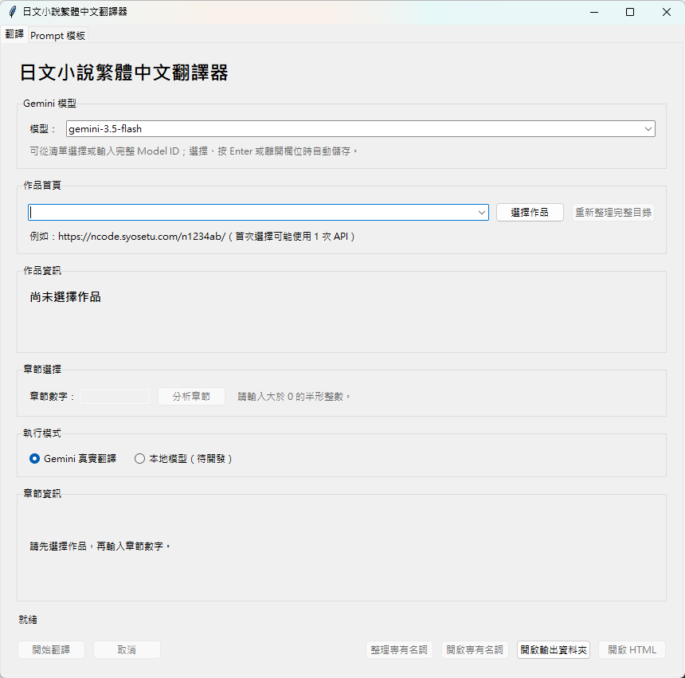

# 日文小說繁體中文翻譯器

以 Python 與 Tkinter 製作的 Windows GUI 工具，從「成為小說家吧」作品頁讀取章節，透過 Gemini 翻譯為繁體中文，並輸出可編輯的 TXT 與適合閱讀的 HTML。

目前為私人開發版本。



## 下載 Windows 版本

[下載 AutoTranslater v0.1.0 Windows ZIP](https://github.com/YungYiHsu/AutoTranslater/releases/download/v0.1.0/AutoTranslater-v0.1.0-win64.zip)

下載後請完整解壓縮，再執行 `AutoTranslater.exe`。ZIP 根目錄已直接包含程式檔，不會再多包一層 `AutoTranslater/`。私人儲存庫的附件需要先登入具有存取權限的 GitHub 帳號。

## 目前功能

- 輸入作品首頁或章節網址；章節網址會自動拆分為作品與章節。
- 從本機作品下拉選單快速載入既有作品。
- 在 GUI 選擇 Gemini 3.5 Flash／Flash-Lite，或手動輸入其他 Model ID；自訂項目會永久加入下拉選單並寫入 `config.json`。
- 讀取作品名稱、作者、摘要與章節目錄。
- 首次選擇作品時翻譯作品名稱及摘要，建立作品專屬資料夾與 `work.json`。
- 以數字選擇章節，並顯示下一個待翻譯章節。
- 依自然段落切割長篇正文，顯示「翻譯第 i/n 個 chunk 中」。
- 章節完成時另外翻譯章節名稱；TXT 與 HTML 以中文作品名、中文章節名為主，並保留日文原名。
- 每個 chunk 完成後立即寫入 checkpoint；中斷後可接續。
- 輸出固定命名的 `0001 - 作品名稱.txt` 與 `.html`。
- TXT 是可手動修正的正文來源；開啟 HTML 時若內容不同，會詢問是否以 TXT 覆蓋 HTML。
- GUI 內可編輯章節翻譯與作品資料翻譯 Prompt。
- 每部作品使用簡單的 `terms.json` 保存「日文原詞 → 繁體中文譯名」。
- 翻譯前自動找出本章已知名詞並加入每個 chunk 的完整 Prompt。
- 每個 chunk 翻譯後由 Gemini 分析新名詞並加入本章暫時記憶，供後續 chunk 使用；整章成功後才一次寫入 `terms.json`，衝突時保留舊譯名。
- GUI 可手動執行「整理專有名詞」：完整詞庫依每批最多 500 組或 40,000 字元送交 Gemini，相鄰批次重疊 5 組；每批都會獨立預覽，可選擇套用、略過或停止，正常翻譯不會自動整理。
- 手動執行「重新整理完整目錄」，取得作者改稿後的最新章節目錄。

目前雲端翻譯只支援 Gemini。本地模型選項保留於 GUI，但尚未實作。

## 環境需求

- Windows 10 或 Windows 11
- Python 3.12
- [uv](https://docs.astral.sh/uv/)
- Gemini API Key

## 建立環境

在專案根目錄執行：

```powershell
uv sync --dev
Copy-Item .env.example .env
```

編輯 `.env`：

```dotenv
GEMINI_API_KEY="你的 API Key"
```

一般設定位於 `config.json`：

```json
{
  "model": "gemini-3.5-flash",
  "saved_models": [],
  "output_directory": "outputs",
  "chunk_size": 4000,
  "retry_attempts": 3
}
```

## 啟動 GUI

不顯示終端視窗：

```powershell
Start-Process .\.venv\Scripts\pythonw.exe -ArgumentList 'gui_main.py' -WorkingDirectory (Get-Location) -WindowStyle Hidden
```

開發除錯時可改用：

```powershell
uv run python gui_main.py
```

## Windows 可攜版

正式發布包採用 PyInstaller `onedir` 模式。請先將 ZIP 完整解壓縮到具有寫入權限的資料夾，再執行 `AutoTranslater.exe`。請勿直接從 ZIP 內執行，也不建議放在 `C:\Program Files`。

### 使用發布 ZIP

1. 從私人 GitHub 儲存庫的 Releases 下載 `AutoTranslater-v0.1.0-win64.zip`。
2. 將 ZIP 完整解壓縮到自己的文件或工具資料夾。
3. 保留 `AutoTranslater.exe`、`config.json` 與 `_internal/` 的相對位置。
4. 執行 `AutoTranslater.exe`；不需要另外安裝 Python。

### API Key 與免費額度

第一次使用 Gemini 功能時，GUI 會要求輸入 Gemini API Key，並將它保存在 EXE 同層的 `.env`。請勿分享、上傳或將含有 `.env` 的資料夾交給他人。

Gemini 免費方案有請求次數限制。額度用完時程式會顯示專用訊息；請等待額度重置，或前往 Google AI Studio 查看用量與方案。

### Windows SmartScreen

目前 Windows 版本尚未進行程式碼簽章，因此第一次啟動時可能出現 SmartScreen 警告。請只執行從此私人儲存庫下載，且 SHA-256 與發布頁一致的檔案。

程式會在 EXE 同層讀取 `config.json`，並建立下列使用者資料：

- `.env`
- `prompts/`
- `outputs/`
- `checkpoints/`
- `logs/`

缺少 `config.json` 時，程式會建立模型名稱為空白的設定並在使用 Gemini 時報錯；正式發布 ZIP 因此必須保留 EXE 同層的 `config.json`。

開發者可在專案根目錄執行：

```powershell
.\scripts\build_windows.ps1
```

建置腳本使用 `AutoTranslater.spec`，將內建 `resources/` 收入程式，並把外部 `config.json` 複製到：

```text
dist/AutoTranslater/
├── AutoTranslater.exe
├── config.json
└── _internal/
```

### 驗證 SHA-256

在 ZIP 所在資料夾執行：

```powershell
Get-FileHash .\AutoTranslater-v0.1.0-win64.zip -Algorithm SHA256
```

將輸出的 Hash 與 GitHub Release 公布的值逐字比對。SHA-256 可確認下載檔案與發布版本相同，但不能取代程式碼簽章。

目前 `v0.1.0` Windows ZIP 的 SHA-256：

```text
57AEC48C9FC1E86AAD682E593BEDB1E53E15371D5941C31BC0221775FF5CBA72
```

## 使用流程

1. 在作品欄貼上作品首頁／章節網址，或選擇本機作品。
2. 按「選擇作品」，等待作品資料與摘要完成。
3. 輸入章節數字並按「分析章節」。分析只會擷取、切塊與檢查 checkpoint，不呼叫 Gemini。
4. 確認 chunk 數量後按「開始翻譯」。
5. 完成後可開啟 HTML 或輸出資料夾。

若作品或章節不存在，程式會顯示錯誤。既有輸出、手動修改過的摘要或 TXT/HTML 衝突，會先要求使用者確認，不會另外產生重複檔案。

## 資料位置

```text
outputs/<作品名稱>/
├── work.json
├── chapters.json
├── terms.json
├── synopsis.txt
├── 0001 - 作品名稱.txt
└── 0001 - 作品名稱.html

checkpoints/
└── <工作識別碼>.json

prompts/
├── translation.txt
└── work_metadata_translation.txt
```

`resources/prompts/` 保存程式預設 Prompt；`prompts/` 是使用者可修改的副本，兩者用途不同。

章節 Prompt 支援 `{Novel_Content}` 與 `{Term_Memory}`。GUI 保留標記不展開；API 請求送出前才分別替換成目前 chunk 與本章匹配到的既有名詞。標記缺少時內容會自動附加在最後，重複標記則拒絕儲存或翻譯。

專有名詞記憶只以作品資料夾內的 `terms.json` 為準，不寫入正文 checkpoint。每個 chunk 的名詞分析只會收到該 chunk 的原文、譯文，以及當時已套用的正式與暫時名詞；中斷後會從既有正文 checkpoint 重新建立本章暫時記憶。

## 品質檢查

```powershell
uv run ruff check .
uv run pytest -p no:cacheprovider --basetemp .codex-test-tmp
```

## 專案架構

```text
core/          核心流程、設定、切塊、checkpoint 與作品記憶
extractors/    Syosetu 作品及章節擷取
translators/   Gemini 翻譯策略
formatters/    TXT 與 HTML 輸出
ui/            Tkinter GUI 與背景工作執行緒
resources/     內建 Prompt 與 HTML 模板
tests/         自動化測試
gui_main.py    GUI 入口
```

## 尚未完成

- 本地模型翻譯
- GitHub 第一版發布

## 授權狀態

本專案目前未提供開源授權，保留所有權利。未經作者明確書面許可，不得商業使用、修改或重新散布。
